# 📊 LIVRIA - Diagramas Técnicos

> **Formato:** Mermaid  
> **Visualização:** VSCode (extensão Mermaid), Notion, Mermaid Live Editor  
> **Conteúdo:** ER, Arquitetura, Fluxos, Sequências, Estados

---

## 📋 Índice

1. [Entity-Relationship (ER)](#1-entity-relationship-er)
2. [Arquitetura do Sistema](#2-arquitetura-do-sistema)
3. [Fluxos de Usuário](#3-fluxos-de-usuário)
4. [Diagramas de Sequência](#4-diagramas-de-sequência)
5. [Máquinas de Estado](#5-máquinas-de-estado)
6. [Fluxos de Dados](#6-fluxos-de-dados)

---

## 1. Entity-Relationship (ER)

### 1.1 Core - Usuários e Autenticação


### 1.2 Rede Social - Posts e Interações

```mermaid
erDiagram
    Post ||--o{ Comment : has
    Post ||--o{ Like : receives
    Post ||--o{ Post : shared_as
    Post }o--|| User : authored_by
    Post }o--o| Book : references
    Post }o--o| Chapter : previews

    Comment }o--|| Post : belongs_to
    Comment }o--|| User : written_by
    Comment }o--o| Comment : replies_to

    Like }o--|| Post : on
    Like }o--|| User : by

    Follow }o--|| User : follower
    Follow }o--|| User : following

    Post {
        uuid id PK
        uuid userId FK
        enum type
        text content
        string mediaUrl
        uuid bookId FK
        uuid chapterId FK
        uuid sharedPostId FK
        int likeCount
        int commentCount
        int shareCount
        datetime createdAt
    }

    Comment {
        uuid id PK
        uuid postId FK
        uuid userId FK
        text content
        uuid parentId FK
        int likeCount
        datetime createdAt
    }

    Like {
        uuid id PK
        uuid postId FK
        uuid userId FK
        datetime createdAt
    }

    Follow {
        uuid id PK
        uuid followerId FK
        uuid followingId FK
        datetime createdAt
    }
```



### 1.3 Comunicação - Mensagens e Notificações


### 1.4 Gamificação - Livras e Conquistas


### 1.5 Grupos e Campanhas


### 1.6 Stories


### 1.7 Livros e Narração (Existente)


---

## 2. Arquitetura do Sistema

### 2.1 Visão Geral da Arquitetura


### 2.2 Fluxo de Request/Response


### 2.3 Arquitetura de Cache (Feed)

```mermaid
flowchart TB
    subgraph Request["📥 Request: GET /feed"]
        USER["User ID"]
    end

    subgraph Cache["🗄️ Redis Cache"]
        FEED_CACHE["feed:{userId}<br/>Sorted Set"]
    end

    subgraph Database["💾 Database"]
        POSTS["Posts Table"]
        FOLLOWS["Follows Table"]
    end

    subgraph Response["📤 Response"]
        RESULT["Posts Array"]
    end

    USER --> CHECK{Cache Exists?}
    CHECK -->|Yes| FEED_CACHE
    CHECK -->|No| FOLLOWS
    FOLLOWS --> POSTS
    POSTS --> BUILD["Build Feed"]
    BUILD --> FEED_CACHE
    FEED_CACHE --> RESULT
```



### 2.4 Arquitetura de Real-time


---

## 3. Fluxos de Usuário

### 3.1 Fluxo de Onboarding


### 3.2 Fluxo de Criação de Post

```mermaid
flowchart TD
    START([Feed]) --> CLICK["Clica em 'Novo Post'"]
    CLICK --> COMPOSER["Abre Composer"]
    
    COMPOSER --> TYPE{Tipo de Post?}
    
    TYPE -->|Texto| TEXT_INPUT["Digita Texto"]
    TYPE -->|Imagem| UPLOAD["Upload de Imagem"]
    TYPE -->|Livro| SELECT_BOOK["Seleciona Livro"]
    TYPE -->|Preview| SELECT_CHAPTER["Seleciona Capítulo"]
    
    TEXT_INPUT --> VALIDATE{Válido?}
    UPLOAD --> TEXT_INPUT
    SELECT_BOOK --> TEXT_INPUT
    SELECT_CHAPTER --> TEXT_INPUT
    
    VALIDATE -->|Não| COMPOSER
    VALIDATE -->|Sim| PUBLISH["Publicar"]
    
    PUBLISH --> CREATE_POST["Criar Post no DB"]
    CREATE_POST --> FANOUT["Distribuir para Feeds"]
    FANOUT --> NOTIFY["Notificar Seguidores"]
    
    NOTIFY --> SHOW["Mostrar no Feed"]
    SHOW --> END([Fim])
```



### 3.3 Fluxo de Assinatura

```mermaid
flowchart TD
    START([Usuário FREE]) --> TRIGGER{Trigger?}
    
    TRIGGER -->|Ver Planos| PLANS["Página de Planos"]
    TRIGGER -->|Limite Atingido| UPGRADE_MODAL["Modal de Upgrade"]
    TRIGGER -->|Tentar Feature| BLOCK["Bloqueio com CTA"]
    
    PLANS --> SELECT["Seleciona Plano"]
    UPGRADE_MODAL --> SELECT
    BLOCK --> SELECT
    
    SELECT --> CHECKOUT["Stripe Checkout"]
    CHECKOUT --> PAY{Pagamento?}
    
    PAY -->|Sucesso| WEBHOOK["Webhook: checkout.completed"]
    PAY -->|Falha| ERROR["Erro de Pagamento"]
    PAY -->|Cancelar| PLANS
    
    ERROR --> CHECKOUT
    
    WEBHOOK --> UPDATE["Atualiza Subscription"]
    UPDATE --> GRANT["Concede Livras"]
    GRANT --> NOTIFY["Notifica Usuário"]
    NOTIFY --> SUCCESS["Tela de Sucesso"]
    
    SUCCESS --> END([Usuário PREMIUM/PRO])
```



### 3.4 Fluxo de Gamificação (Ganhar Livras)

```mermaid
flowchart TD
    START([Ação no Sistema]) --> ACTION{Qual Ação?}
    
    ACTION -->|Curtida Recebida| LIKE["like.service.ts"]
    ACTION -->|Comentário Recebido| COMMENT["comment.service.ts"]
    ACTION -->|Novo Seguidor| FOLLOW["follow.service.ts"]
    ACTION -->|Campanha Completa| CAMPAIGN["campaign.service.ts"]
    ACTION -->|Conquista| ACHIEVEMENT["achievement.service.ts"]
    ACTION -->|Plano Mensal| CRON["cron: monthly"]
    
    LIKE --> CONFIG["Busca Config: earn_like_received"]
    COMMENT --> CONFIG
    FOLLOW --> CONFIG
    CAMPAIGN --> CONFIG
    ACHIEVEMENT --> CONFIG
    CRON --> CONFIG
    
    CONFIG --> LIVRA_SVC["livraService.addLivras()"]
    
    LIVRA_SVC --> TRANSACTION["Cria Transação"]
    TRANSACTION --> UPDATE["Atualiza Balance"]
    UPDATE --> NOTIFY["Cria Notificação"]
    NOTIFY --> WEBSOCKET["Emite WebSocket"]
    
    WEBSOCKET --> UI["Atualiza UI"]
    UI --> ANIMATION["+X Livras Animation"]
    
    ANIMATION --> END([Saldo Atualizado])
```



### 3.5 Fluxo de Stories

```mermaid
flowchart TD
    START([Usuário]) --> VIEW{Ação?}
    
    VIEW -->|Criar| CREATE_FLOW
    VIEW -->|Ver| VIEW_FLOW
    
    subgraph CREATE_FLOW["Criar Story"]
        C1["Clica em +"] --> C2["Escolhe Tipo"]
        C2 --> C3{Tipo?}
        C3 -->|Texto| C4["Digita + Background"]
        C3 -->|Imagem| C5["Upload"]
        C3 -->|Quote| C6["Seleciona Trecho"]
        C4 --> C7["Preview"]
        C5 --> C7
        C6 --> C7
        C7 --> C8["Publicar"]
        C8 --> C9["Salva com expiresAt = +24h"]
    end
    
    subgraph VIEW_FLOW["Ver Stories"]
        V1["Clica no Avatar"] --> V2["Abre Fullscreen"]
        V2 --> V3["Mostra Story"]
        V3 --> V4["Progress Bar 5s"]
        V4 --> V5{Próximo?}
        V5 -->|Auto/Tap| V6["Próximo Story"]
        V5 -->|Último| V7["Próximo Usuário"]
        V5 -->|Swipe Down| V8["Fecha"]
        V6 --> V3
        V7 --> V3
    end
    
    C9 --> END1([Story Criado])
    V8 --> END2([Volta ao Feed])
```



---

## 4. Diagramas de Sequência

### 4.1 Login e Autenticação


### 4.2 Criar Post com Fanout


### 4.3 Curtir Post (com Livras)


### 4.4 Gerar Narração TTS

```mermaid
sequenceDiagram
    actor User
    participant Frontend
    participant API
    participant TTSController
    participant LivraMiddleware
    participant LivraService
    participant TTSService
    participant Queue
    participant Worker
    participant Gemini
    participant Storage
    participant Database

    User->>Frontend: Clica em "Gerar Narração"
    Frontend->>API: POST /api/chapters/:id/narrate
    
    API->>LivraMiddleware: checkLivras('cost_tts_chapter')
    LivraMiddleware->>LivraService: hasSufficientBalance(userId, 10)
    LivraService->>Database: getBalance(userId)
    
    alt Saldo Suficiente
        LivraMiddleware->>API: next() with req.livraCost = 10
        API->>TTSController: generateNarration()
        
        TTSController->>LivraService: spendLivras(userId, 10, 'SPENT_TTS')
        LivraService->>Database: createTransaction()
        LivraService->>Database: updateBalance()
        
        TTSController->>Queue: add('tts-generation', { chapterId })
        Queue-->>TTSController: Job created
        TTSController-->>API: { jobId, status: 'processing' }
        API-->>Frontend: 202 Accepted
        Frontend-->>User: "Gerando narração..."
        
        Queue->>Worker: Process job
        Worker->>Database: getChapter(chapterId)
        Worker->>TTSService: generate(text, characters)
        TTSService->>Gemini: generateAudio(text, voice)
        Gemini-->>TTSService: Audio buffer
        TTSService->>Storage: upload(audio)
        Storage-->>TTSService: audioUrl
        Worker->>Database: updateChapter(audioUrl)
        Worker->>Frontend: WebSocket: 'tts:complete'
        Frontend-->>User: "Narração pronta!"
        
    else Saldo Insuficiente
        LivraMiddleware-->>API: 402 Payment Required
        API-->>Frontend: { error, required: 10, current: 5 }
        Frontend-->>User: Modal "Comprar Livras"
    end
```



### 4.5 Webhook do Stripe (Assinatura)

```mermaid
sequenceDiagram
    participant Stripe
    participant API
    participant StripeService
    participant SubscriptionService
    participant LivraService
    participant Database
    participant WebSocket

    Stripe->>API: POST /api/subscription/webhook
    API->>StripeService: handleWebhook(payload, signature)
    StripeService->>StripeService: verifySignature()
    
    alt checkout.session.completed
        StripeService->>StripeService: extractSessionData()
        StripeService->>SubscriptionService: createSubscription(userId, plan)
        SubscriptionService->>Database: upsertSubscription()
        SubscriptionService->>Database: updateUserRole()
        
        SubscriptionService->>LivraService: addLivras(userId, monthlyAmount, 'EARNED_PLAN')
        LivraService->>Database: createTransaction()
        
        SubscriptionService->>WebSocket: emit('subscription:updated', userId)
        
    else invoice.paid (renewal)
        StripeService->>SubscriptionService: renewSubscription()
        SubscriptionService->>Database: updatePeriodDates()
        SubscriptionService->>LivraService: addLivras(userId, monthlyAmount, 'EARNED_PLAN')
        
    else customer.subscription.deleted
        StripeService->>SubscriptionService: cancelSubscription()
        SubscriptionService->>Database: updateSubscription(status: CANCELLED)
        SubscriptionService->>Database: updateUserRole(USER)
    end
    
    StripeService-->>API: { received: true }
    API-->>Stripe: 200 OK
```

---

## 5. Máquinas de Estado

### 5.1 Estado da Assinatura

```mermaid
stateDiagram-v2
    [*] --> FREE: Cadastro
    
    FREE --> TRIALING: Inicia Trial
    FREE --> ACTIVE: Assina Plano
    
    TRIALING --> ACTIVE: Pagamento Confirmado
    TRIALING --> FREE: Trial Expirado
    
    ACTIVE --> PAST_DUE: Pagamento Falhou
    ACTIVE --> CANCELLED: Cancelou
    
    PAST_DUE --> ACTIVE: Pagamento Regularizado
    PAST_DUE --> CANCELLED: 3 Tentativas Falhas
    
    CANCELLED --> FREE: Período Encerrado
    CANCELLED --> ACTIVE: Reativou
    
    FREE --> [*]: Conta Deletada
```

### 5.2 Estado do Post

```mermaid
stateDiagram-v2
    [*] --> DRAFT: Iniciou Composição
    
    DRAFT --> PUBLISHED: Publicou
    DRAFT --> [*]: Descartou
    
    PUBLISHED --> DELETED: Autor/Admin Deletou
    PUBLISHED --> HIDDEN: Moderação
    PUBLISHED --> PUBLISHED: Editou
    
    HIDDEN --> PUBLISHED: Liberado
    HIDDEN --> DELETED: Confirmado
    
    DELETED --> [*]
```

### 5.3 Estado do Story

```mermaid
stateDiagram-v2
    [*] --> CREATING: Abre Creator
    
    CREATING --> ACTIVE: Publicou
    CREATING --> [*]: Cancelou
    
    ACTIVE --> EXPIRED: 24h Passaram
    ACTIVE --> DELETED: Autor Deletou
    
    EXPIRED --> CLEANED: Worker Cleanup
    DELETED --> CLEANED: Imediato
    
    CLEANED --> [*]

    note right of ACTIVE
        viewCount incrementa
        a cada visualização
    end note
```

### 5.4 Estado da Campanha de Leitura

```mermaid
stateDiagram-v2
    [*] --> DRAFT: Admin Cria
    
    DRAFT --> ACTIVE: Data Início Chegou
    DRAFT --> CANCELLED: Admin Cancelou
    
    ACTIVE --> COMPLETED: Data Fim Chegou
    ACTIVE --> CANCELLED: Admin Cancelou
    
    COMPLETED --> [*]: Livras Distribuídas
    CANCELLED --> [*]
    
    note right of ACTIVE
        Membros podem marcar
        livros como lidos
    end note
```

### 5.5 Estado da Conquista (por Usuário)

```mermaid
stateDiagram-v2
    [*] --> LOCKED: Conquista Existe
    
    LOCKED --> CHECKING: Ação Disparou Check
    
    CHECKING --> LOCKED: Requisitos Não Atendidos
    CHECKING --> UNLOCKED: Requisitos Atendidos
    
    UNLOCKED --> UNLOCKED: Permanente
    
    note right of UNLOCKED
        Livras concedidas
        Notificação enviada
        Toast exibido
    end note
```

---

## 6. Fluxos de Dados

### 6.1 Fluxo de Dados do Feed

```mermaid
flowchart LR
    subgraph Input["📥 Entrada"]
        USER["Usuário"]
        POST["Novo Post"]
    end

    subgraph Processing["⚙️ Processamento"]
        FEED_SVC["Feed Service"]
        CACHE["Redis Cache"]
        DB["PostgreSQL"]
    end

    subgraph Output["📤 Saída"]
        FEED["Feed Renderizado"]
        WS["WebSocket Update"]
    end

    USER -->|GET /feed| FEED_SVC
    FEED_SVC -->|Check Cache| CACHE
    CACHE -->|Miss| DB
    DB -->|Posts| CACHE
    CACHE -->|Hit| FEED_SVC
    FEED_SVC --> FEED

    POST -->|Created| FEED_SVC
    FEED_SVC -->|Fanout| CACHE
    FEED_SVC --> WS
    WS --> FEED
```

### 6.2 Fluxo de Dados de Livras

```mermaid
flowchart TB
    subgraph Triggers["🎯 Gatilhos"]
        LIKE["Curtida"]
        COMMENT["Comentário"]
        FOLLOW["Follow"]
        CAMPAIGN["Campanha"]
        PURCHASE["Compra"]
        PLAN["Plano Mensal"]
    end

    subgraph Service["⚙️ Livra Service"]
        ADD["addLivras()"]
        SPEND["spendLivras()"]
        EXPIRE["expireLivras()"]
    end

    subgraph Storage["💾 Armazenamento"]
        BALANCE["LivraBalance"]
        TRANS["LivraTransaction"]
    end

    subgraph Notifications["📢 Notificações"]
        NOTIF["Notification"]
        WS["WebSocket"]
        UI["UI Update"]
    end

    LIKE --> ADD
    COMMENT --> ADD
    FOLLOW --> ADD
    CAMPAIGN --> ADD
    PURCHASE --> ADD
    PLAN --> ADD

    ADD --> BALANCE
    ADD --> TRANS
    ADD --> NOTIF
    ADD --> WS

    SPEND --> BALANCE
    SPEND --> TRANS

    EXPIRE --> BALANCE
    EXPIRE --> TRANS

    NOTIF --> UI
    WS --> UI
```

### 6.3 Fluxo de Notificações Real-time

```mermaid
flowchart TB
    subgraph Sources["📡 Fontes de Eventos"]
        LIKE["Like Created"]
        COMMENT["Comment Created"]
        FOLLOW["Follow Created"]
        MESSAGE["Message Sent"]
        ACHIEVE["Achievement Unlocked"]
        LIVRA["Livras Earned"]
    end

    subgraph NotifService["⚙️ Notification Service"]
        CREATE["createNotification()"]
        EMIT["emitToUser()"]
    end

    subgraph Transport["🚀 Transporte"]
        DB["PostgreSQL"]
        REDIS["Redis Pub/Sub"]
        SOCKETIO["Socket.io"]
    end

    subgraph Client["📱 Cliente"]
        HANDLER["Notification Handler"]
        TOAST["Toast Component"]
        BELL["Bell Badge"]
        LIST["Notification List"]
    end

    Sources --> CREATE
    CREATE --> DB
    CREATE --> EMIT
    EMIT --> REDIS
    REDIS --> SOCKETIO
    SOCKETIO --> HANDLER
    HANDLER --> TOAST
    HANDLER --> BELL
    HANDLER --> LIST
```

---

## 🛠️ Como Visualizar os Diagramas

### VSCode
```bash
# Instalar extensão
ext install bierner.markdown-mermaid
```

### Mermaid Live Editor
1. Acesse: https://mermaid.live/
2. Cole o código Mermaid
3. Exporte como PNG/SVG

### Notion
1. Adicione bloco "Code"
2. Selecione linguagem "Mermaid"
3. Cole o código

### GitHub
Mermaid é renderizado automaticamente em arquivos `.md`

---

**Total de Diagramas:** 25+  
**Tipos:** ER, Arquitetura, Fluxo, Sequência, Estado
